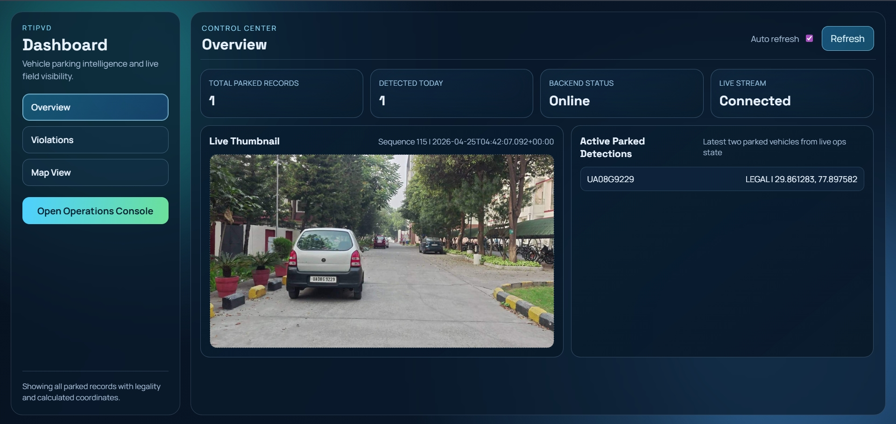
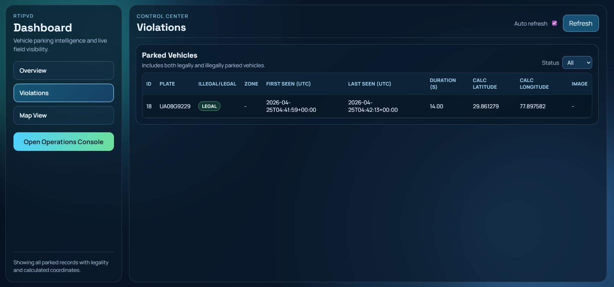
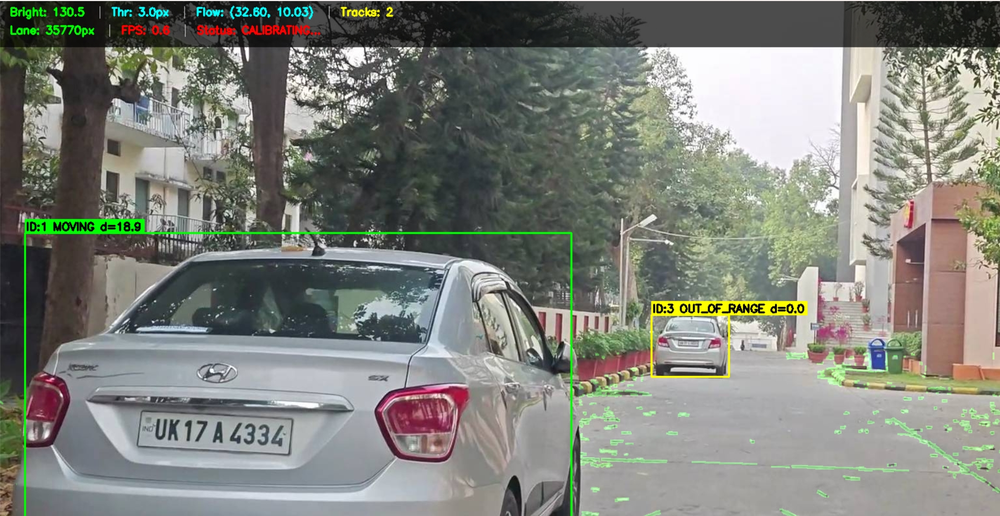
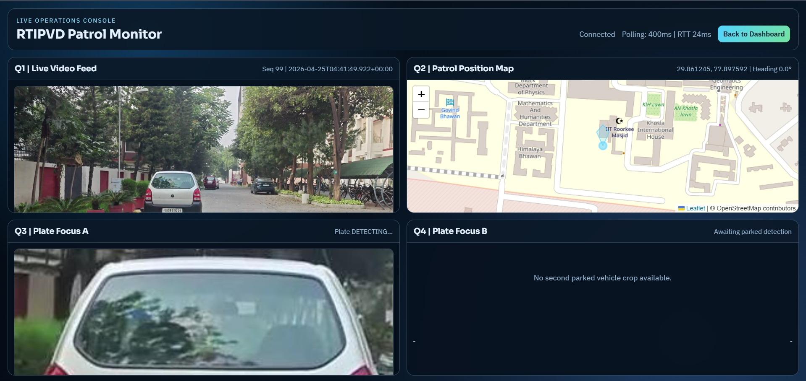
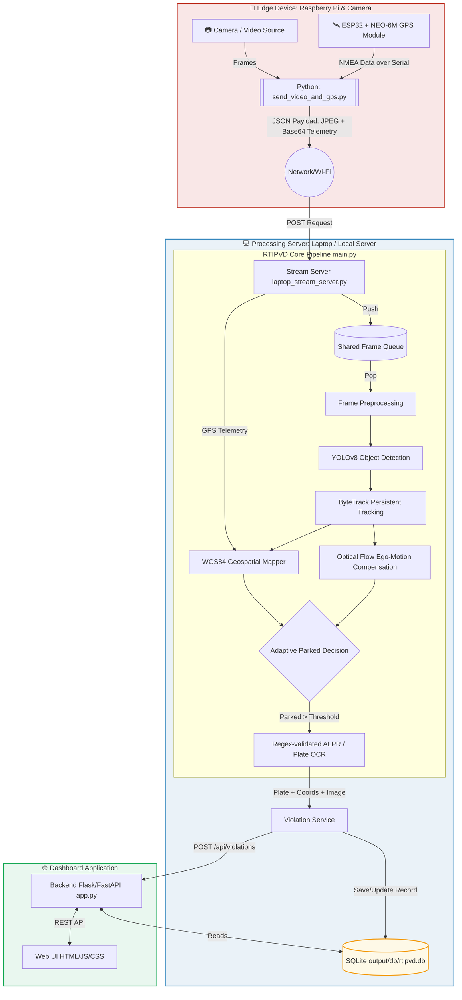

# RTIPVD - Real-Time Illegally Parked Vehicle Detection

  

> IIT Roorkee | 2025

**RTIPVD** is an end-to-end pipeline designed to detect illegally parked vehicles from moving camera feeds (e.g., dashcams, patrol vehicles, drones). It utilizes state-of-the-art computer vision models like YOLOv8 and ByteTrack, coupled with ego-motion compensation, ALPR (Automatic License Plate Recognition), and robust geospatial projection to identify and log parking violations in real-time.

---

## Project Overview

| Property | Details |
|----------|---------|
| Core Engine | Python 3.11 |
| Computer Vision | YOLOv8 (Detection) + ByteTrack (Tracking) |
| Text Recognition | Regex-validated ALPR (OCR) |
| Edge Hardware | Raspberry Pi + ESP32 (with NEO-6M GPS) |
| Processing Server | Laptop / Cloud (CPU & CUDA support) |
| Database | SQLite |
| Web Dashboard | Flask / FastAPI Backend + HTML/JS/CSS |

---

## 📸 System Showcase

| Dashboard Main View | Dashboard Violation Details |
| :---: | :---: |
|  |  |

| Streamed Video Processing | Dashboard Console | Hardware Setup |
| :---: | :---: | :---: |
|  |  |  |

---

## ✨ Key Features

- Moving camera support (dashcam/drone/patrol videos)
- Ego-motion compensation from lane optical flow
- Vehicle detection + persistent tracking
- Adaptive parked/moving threshold calibration
- Plate OCR with regex validation and temporal voting
- Local violation database (SQLite)
- Optional GPS tagging (ESP32 + NEO-6M serial)
- Optional backend sync + dashboard API

---

## 🏗️ Detailed Architecture

The system utilizes a distributed pipeline, separating edge telemetry acquisition from intensive ML processing.



**Workflow Summary:**
1. **Edge Acquisition:** The `send_video_and_gps.py` script synchronizes camera frames and NMEA serial data, transmitting them over HTTP.
2. **Stream Ingestion:** The `laptop_stream_server.py` receives the stream and pushes it into a queue.
3. **Core Pipeline (`main.py`):** YOLOv8 and ByteTrack detect and track vehicles. The Ego-motion component accounts for the patrol vehicle's movement. Bounding boxes are projected into real-world WGS84 coordinates.
4. **Violation Registration:** If a vehicle triggers the parked logic, its license plate is read via OCR, and the `Violation Service` logs it into the SQLite database and syncs it with the dashboard API.

---

## 📁 Repository Structure

- main pipeline: `main.py`
- config: `config/config.py`
- source modules: `src/`
- backend API: `dashboard/backend/`
- dashboard frontend: `dashboard/frontend/`
- deployment profiles:
	- laptop: `deploy/laptop/`
	- raspberry pi: `deploy/raspberry_pi/`

---

## 🚀 Deployment & Quick Start

### 1. Laptop (Processing Server & Dashboard)

Open a **PowerShell** window in the root directory of the project and run the following commands:

**Step 1: Start the Stream Processing Server**
```powershell
powershell -ExecutionPolicy Bypass -File deploy/laptop/start_stream_server.ps1 -Port 8088 -ModelPath weights/best.pt -Device cpu -showDisplay
```

**Step 2: Start the Dashboard Backend**
Open a *new* PowerShell window and run:
```powershell
powershell -ExecutionPolicy Bypass -File deploy/laptop/start_backend.ps1 -DbPath output/db/rtipvd_laptop.db -Port 5000
```

> **🔗 Access the Dashboard:**
> - **Main Dashboard:** [http://localhost:5000](http://localhost:5000)
> - **API Health Check:** [http://localhost:5000/api/health](http://localhost:5000/api/health)
> - **Stream Ingest Endpoint:** `http://localhost:8088/ingest/frame`

---

### 2. Raspberry Pi (Edge Sender Node)

Open a terminal on the Raspberry Pi and follow these steps:

**Step 1: Navigate to the project and activate the virtual environment**
```bash
cd ~/Desktop/RTIPVD
source .venv/bin/activate
```

**Step 2: Set Environment Variables**
Configure the stream and GPS settings. Make sure to replace `<Laptop_IP_Address>` with your laptop's actual IP address, and adjust the GPS port if needed.
```bash
export RTIPVD_VIDEO_SOURCE="data/videos/video.mp4" # Or use /dev/video0 for webcam
export RTIPVD_STREAM_SERVER_URL="http://<Laptop_IP_Address>:8088/ingest/frame"
export RTIPVD_STREAM_SEND_FPS=15
export RTIPVD_STREAM_JPEG_QUALITY=70

# GPS Configuration
export RTIPVD_GPS_ENABLED=true
export RTIPVD_GPS_SOURCE="serial"
export RTIPVD_GPS_SERIAL_PORT="/dev/ttyUSB0" # Change according to your connected GPS module
export RTIPVD_GPS_BAUD_RATE=9600

# Add project root to PYTHONPATH
export PYTHONPATH="/home/rtipvd/Desktop/RTIPVD:${PYTHONPATH:-}"
```

**Step 3: Fix permissions and run the stream sender**
```bash
# Fix Windows line endings (if cloned from Windows)
sed -i 's/\r$//' setup.sh send_stream.sh run_pi.sh

# Make scripts executable
chmod +x setup.sh send_stream.sh run_pi.sh

# Run the sender script
bash send_stream.sh
```

---

## 🌐 API Surface

### Dashboard Data Endpoints
- `GET /api/health`
- `GET /api/violations?limit=100`
- `POST /api/violations`

### Stream Ingest Endpoints
- `POST /ingest/frame`

---

## 🛠️ Additional Resources

- `docs/BEGINNER_GUIDE.md`
- `docs/STREAMING_ARCHITECTURE.md`

---

## 📝 Notes
- **Custom Geofencing:** You can define your own parking zones by placing a custom `.geojson` file in the project directory (e.g., `test_zones.geojson`) and referencing it in the system configuration to suit your specific area.
- Config supports environment variables (`RTIPVD_*`) for profile-based runs.
- CPU-only mode is supported for Raspberry Pi.
- If the backend is disabled, all violations are still stored locally in SQLite.
